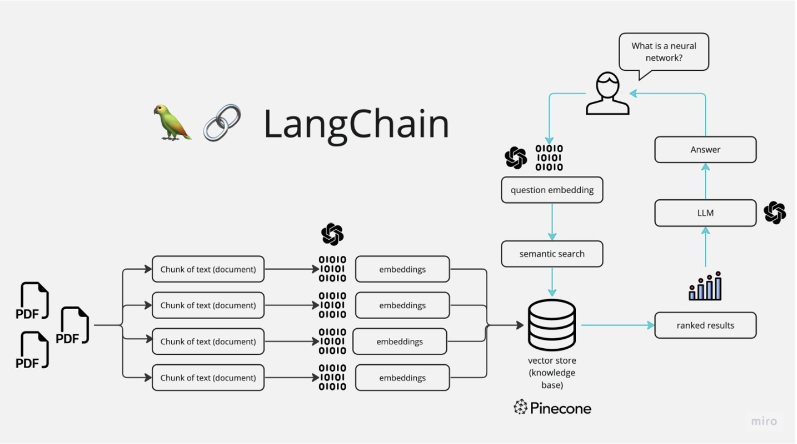

# Healthcare LLM Chatbot using RAG GPT3.5 retriever model w/ chaining:

## Project objective: 
This repository is to create a conversational chatbot that can address readers’ concerns in natural language using information from the trusted articles and in the  healthcare context.

## Proposed idea:
* Using Langchain and Openai model to retrieve top-k candidates from the online sources and pass it to Openai model to find the answer for the query

## Implementation

### 1 Pipeline: 

* Reading Documents: Data from Online PDF files and html files are extracted and loaded to Document loaders
* Chunking:  After loading, data must be split into smaller chunks that can be fit into the LLM model for further processing
  * RecursiveCharacterTextSplitter: Recommended splitter for generic text. It tries to split into blocks based on the following order *[“\n\n”, “\n”, “ “, “”]*
* Create a Vector Database: 
  * Unstructured data is commonly stored by projecting it into an embedding vector space, which provides a real number to each encoded vector. 
  * All the chunks are converted to embedding vector and stored in vector db. 
    * Used FAISS which is efficient for similarity search and clustering of dense vectors
* Search (once per query)
  * Given a user question, generate an embedding for the query from the OpenAI API
  * Using the embeddings, rank the text sections by relevance to the query
* Ask (once per query)
  * Insert the question and the most relevant sections into a message to GPT
  * Return GPT's 
  


### 2 Strategy to mitigate LLM Hallucinations:

* Standard LLM Parameters:
  * setting temperature < 0.3
  * Retreival Docs : controlled generation
    * 1. It means providing enough details and constraints in the prompt to the model 
    * 2. Setting the number of top-k retrieved documents in the range 3 to 5
* Using LLM evaluation metrics:
    * Evaluating LLM response 
      * using Langchain
      * using self-consistency metrics
        1.  SelfCheck-MQAG 
        2.  SelfCheck-BERTScore
        3.  SelfCheck-Ngram
        4.  SelfCheck-NLI based
        5.  SelfCheck-Opensource model
        6.  SelfCheck-openai - since i have used openai for generation, evaluated the responses with self-consistency checks of other methods
### (Optional Challenge)  Assess the performance of the answers generated from the chatbot, given that there are no ground truth Q&A pairs provided to you.  
* For this, I have tried to use Lngchain, QAEvalChain to evaluate the LLM Response. 

  * Manual Annotation for 3 sample queries: For the provided sample queries, I have annotated the sample responses from the extracted docs as ground truth. QAEvalChain can asseses the predicted answers against the annotated responses and returns whether the predicted answer is valid or not.
  * Assesing Openai model(LLM1) generated response as ground truth and validate the response against the LLM2(RetrievalQA with chaining) response as prediction.  QAEvalChain can asseses the predicted answers(LLM2) against the responses(from LLM1) and returns whether the predicted answer is valid or not.

## Getting Started

1. **Clone the Repository:**
   Open your terminal and run the following command to clone this repository to your local machine:
   ```shell
   git clone https://github.com/saravananpsg/healthcare_llm_chatbot.git
   ```
2. **Navigate to the Project Directory:**
   Change your current directory to the project folder:
   ```shell
   cd healthcare_llm_chatbot
   ```
3. **Create a Virtual Environment:**
   It's a good practice to work within a virtual environment to manage this project dependencies. Create a virtual environment using `venv`:
   * option (1) Python in-built virtual environment
   ```shell
   python -m venv venv
   ```
   * option (2) conda environment
   ```shell
   conda create -n <env_name> python=3.11
   ```
   * Note: I have used Langchain features for most of the features for this, it seems python 3.11 is most compatible for now.
4. **Activate the Virtual Environment:**
   On macOS or Linux:
   ```shell
   source venv/bin/activate
   ```
   ```shell
   conda activate <env_name>
   ```
   On Windows:
   ```shell
   .\venv\Scripts\activate
   ```
   You should now see the virtual environment name in your terminal prompt.
5. **Install Dependencies:**
   Use `pip` to install the required dependencies in the environment.
   ```shell
   pip install -r requirements.txt
   ```
6. (Optional preference) Installation and Setup for the OpenAI API key:
   - This step is not mandatory for running the notebook per se. To obtain an OpenAI API key, follow these instructions:
     - Sign up for an OpenAI API key at [OpenAI](https://platform.openai.com/signup).
     - Once you have an API key, create .env file using :
          ```shell
          touch .env
          ```
     - Add the API key in the .env file
     ```shell
       OPENAI_API_KEY="API KEY"
     ```
7. Run the main.py to get individual response from Retriever using GPT 3.5 model

* Sample LLM Resonse using RAG with Openai gpt 3.5 turbo model 

```
(qachain) PS C:\Users\sarav\PycharmProjects\qa_health> python main.py --query "What is gestational diabetes and how is it diagnosed?"             
{
    "answer": "Gestational diabetes mellitus (GDM) is a type of diabetes that develops during pregnancy. It is characterized by high blood sugar levels that occur durin
g pregnancy in women who did not have diabetes before becoming pregnant. GDM is diagnosed through screening tests conducted during pregnancy, typically between 24 to 28
 weeks of gestation. The diagnosis is usually made using a 3-point 75 g oral glucose tolerance test (OGTT), which involves measuring blood sugar levels before and after
 consuming a glucose solution. Women at increased risk of pre-existing diabetes are also screened during the first trimester using non-pregnancy glucose thresholds. If 
the results are normal, they are re-evaluated for GDM later in the pregnancy. After delivery, women diagnosed with diabetes during pregnancy are recommended to undergo further testing to assess their glycaemic status and may need regular screening for diabetes in the following years.",
    "source_docs": [
        {
            "source_doc": "...",
            "source": "https://www.ace-hta.gov.sg/docs/default-source/acgs/gdm---an-update-on-screening-diagnosis-and-follow-up-(may-2018).pdf",
            "relatednesses_score": 0.8571647359531918
        },
        {
            "source_doc": "..",
            "source": "https://www.ace-hta.gov.sg/docs/default-source/acgs/gdm---an-update-on-screening-diagnosis-and-follow-up-(may-2018).pdf",
            "relatednesses_score": 0.8540609797986543
        },
        {
            "source_doc": "...",
            "source": "https://ch-api.healthhub.sg/api/public/content/57349b96ccfe47319fb49d902a064022?v=6a601253&_gl=1*ok09oc*_ga*MTk3Mjg0Mjc5Ni4xNzA3Nzg5OTUw*_ga_VQW1KL2RMR*MTcxMDc1MzAxMS40LjEuMTcxMDc1NDQxNC4xMi4wLjA.",
            "relatednesses_score": 0.8523293387990869
        }
    ]
}
```


9. Run the chat.py for ConversationalRetrieval chain model

Sample LLM response:

```
(qachain) PS C:\Users\sarav\PycharmProjects\qa_health> python chat.py
Chat starting...
Building embedding from the input documents
Embedding file created..
---------------------------------------------------------------------------------
Welcome to the Health care chatBot. You are now ready to start interacting with your documents
---------------------------------------------------------------------------------
User Query: How can my outpatient bill for diabetes be covered?
Answer: 

System: The various means through which your outpatient bill for diabetes can be covered include government subsidies, employee benefits or private medical insurance, MediSave through the Chronic Disease Management Programme (CDMP), and out-of-pocket payment. You can also tap on accounts of immediate family members, such as your spouse, parents, and children, for MediSave. Additionally, patients who are ≥ 60 years old can use their own and their spouse's MediSave for the 15% co-payment under CDMP.
User Query: What is gestational diabetes and how is it diagnosed? 
Answer: 

System: Gestational diabetes is a type of diabetes that occurs during pregnancy. It is diagnosed through screening at 24 to 28 weeks of gestation using a 3-point 75 g o
ral glucose tolerance test (OGTT). This test is recommended for all pregnant women, unless they have already been diagnosed with diabetes or pre-diabetes. If a woman is found to have gestational diabetes, she will need to be regularly screened for diabetes every 1 to 3 years after delivery.

```

10. Built a streamlit app for demo with minimal features.

```
streamlit run app.py
```

### Future Improvement:

* Benchmarking with different open source LLM models
  * Llama, Vicuna, Mistral
  * Current constraints - computing resources
* Preprocessing html pages 
  * cleaning and removing unwanted contents
* Adding Multi-modal features to enhance the LLM Responses
  * Full Multimodal RAG might increase the LLM hallucination, as the summaries from image features are not reliable compared to text
* Improving the conversational chat features with buffer memory and improving small talks